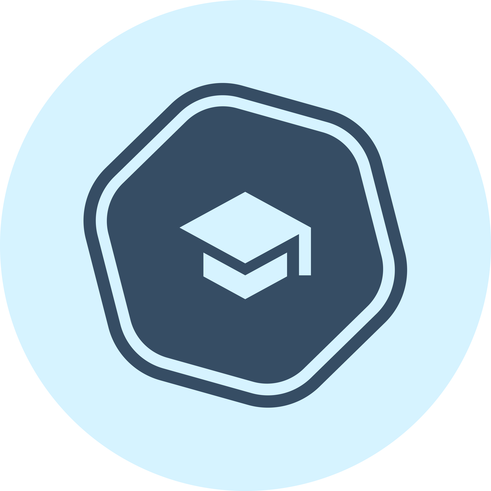
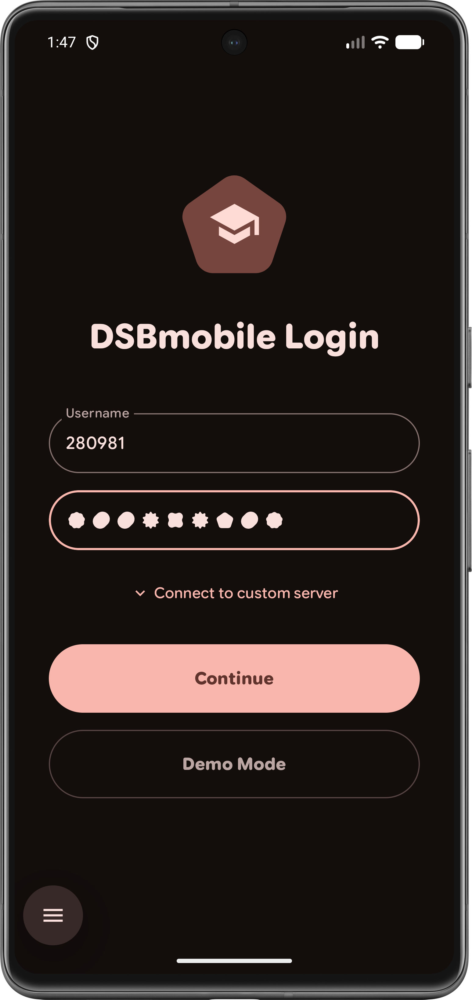
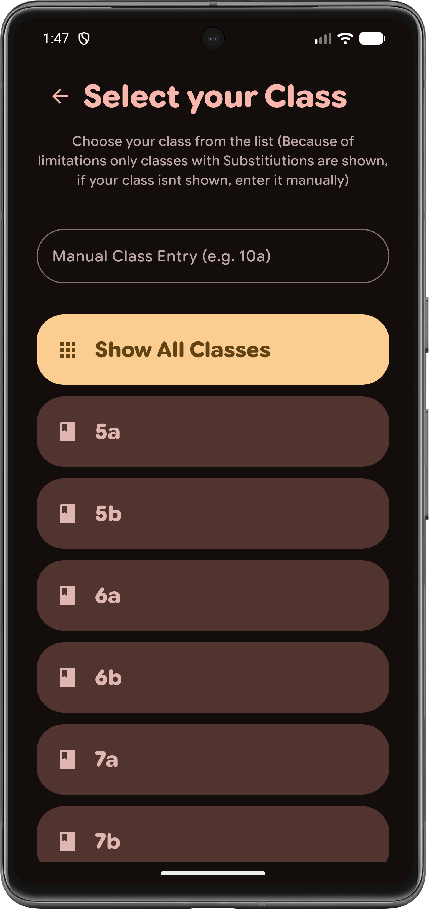
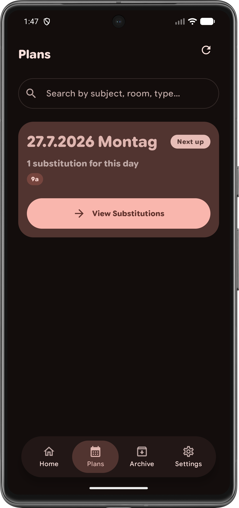
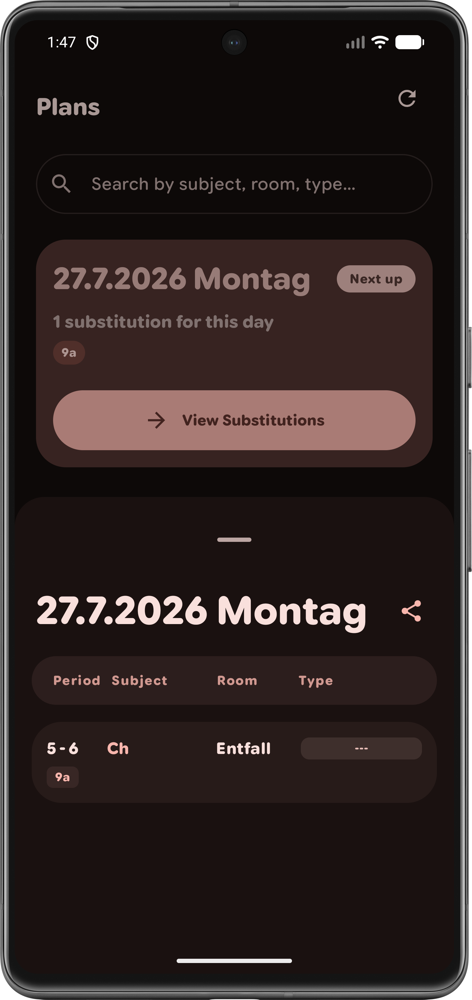

<div align="center">

# Velo.Schulplaner 🎒

**Material You Expressive Schul- & Vertretungsplaner für die Merianschule Seligenstadt**



[](https://github.com/WollyDev24/DSBmaterial)
[](https://github.com/WollyDev24/DSBmaterial/issues)
[](LICENSE)
[](https://github.com/WollyDev24/DSBmaterial/releases/latest)
[](https://kotlinlang.org)
[](https://wolly.is-a.dev/dsbmaterial)

</div>

Ein moderner, nativer **Material You Expressive** Vertretungs- und Schulplaner für die **Merianschule Seligenstadt** (basierend auf DSBmobile).

Velo.Schulplaner ist von Grund auf mit **Kotlin** und **Jetpack Compose** entwickelt.

---

## ✨ Features

- 🎨 **Material You Expressive design** — dynamic color, themes, motion
- 🎛️ **Theme picker** — many accent colors to choose from
- 🧩 **Home-screen widget** — the latest substitution plan at a glance
- 🔄 **Automatic background refresh** — always up to date
- 🗄️ **Archive** — browse past substitution plans
- 📅 **Calendar view** — see your schedule by date
- 🌐 **Local webserver** — share the plan on your home network
- 🐞 **Debug mode** — plus offline / state screens

## 📸 Screenshots

<p align="center">
  
  
  
  
</p>

## ⬇️ Download

| Source | Link |
| ------ | ---- |
| **Obtainium** | [Add repository](https://apps.obtainium.imranr.dev/redirect?r=obtainium://add/https://github.com/WollyDev24/DSBmaterial) |
| **GitHub Releases** | [Latest release](https://github.com/WollyDev24/DSBmaterial/releases/latest) |
| **Website** | [wolly.is-a.dev/dsbmaterial](https://wolly.is-a.dev/DSBmaterial) |
| ~~F-Droid~~ | _Coming soon_ |

## 🧱 Built with

- [Kotlin](https://kotlinlang.org) + [Jetpack Compose](https://developer.android.com/jetpack/compose) / Material 3
- [OkHttp](https://square.github.io/okhttp/) · [jsoup](https://jsoup.org) · [Gson](https://github.com/google/gson)
- [DataStore](https://developer.android.com/topic/libraries/architecture/datastore)
- [Glance](https://developer.android.com/develop/ui/compose/glance) (widget)
- [WorkManager](https://developer.android.com/topic/libraries/architecture/workmanager) · [NanoHTTPD](https://github.com/NanoHttpd/nanohttpd)

## 📂 Project structure

```text
app/src/main/
├── assets/webserver/           # Self-contained browser page for the local webserver
├── res/
│   ├── font/google_sans_flex.ttf  # Bundled variable font (SIL OFL 1.1)
│   └── ...                         # Layouts, values, themes, app icon
└── java/dev/wolly/dsbmaterial/
    ├── api/
    │   └── DSBMobileAPI.kt       # API client for DSBmobile (GZIP/HTML parsing)
    ├── data/
    │   ├── DataStoreManager.kt   # Persistent storage for settings & credentials
    │   └── Models.kt             # Data classes for substitution entries
    ├── ui/
    │   ├── theme/                # Material 3 Theme, Color, Type, Shape, Motion
    │   ├── components/           # Shared UI components (sliders, buttons, layout)
    │   ├── screens/              # Home, Substitutions, Archive, Calendar, Settings,
    │   │                         # Theme picker, About, Share card, Debug mode, State screens
    │   └── MainViewModel.kt      # Business logic and UI state
    ├── AutoFetchWorker.kt        # Background auto-refresh of the substitution plan
    ├── LocalWebServer.kt         # NanoHTTPD server serving the plan over the local network
    ├── DSBWidget.kt / DSBWidgetReceiver.kt  # Home-screen widget
    ├── DSBApp.kt                 # Application class
    └── MainActivity.kt           # Main entry point and all Compose UI screens
```

## 🛠️ Building from source

1. **Clone the repository**
   ```bash
   git clone https://github.com/WollyDev24/DSBmaterial
   ```
2. **Open in Android Studio** — *Open an Existing Project*, select the cloned directory
3. **Sync and build** — let Gradle resolve dependencies, then *Build → Make Project*
4. **Run** — connect a device or start an emulator, then press *Run* ▶️

> Prefer the command line?
> ```bash
> ./gradlew assembleRelease
> ```

## 🤝 Contributing

Contributions are welcome! Please feel free to submit a pull request.

1. Fork the repository
2. Create your feature branch: `git checkout -b feature/AmazingFeature`
3. Commit your changes: `git commit -m 'Add some AmazingFeature'`
4. Push to the branch: `git push origin feature/AmazingFeature`
5. Open a pull request

## ⭐ Special thanks

- [Tenner/dsbmobile](https://github.com/Tenner/dsbmobile) — understanding and usage of the DSBmobile API

## 📄 License

This project is licensed under the **Apache 2.0 License** — see the [LICENSE](LICENSE) file for details.
Third-party attributions are listed in the [NOTICE](NOTICE) file.

---

<div align="center">

Made with ❤️ by [WollyDev24](https://github.com/wollydev24)

</div>
